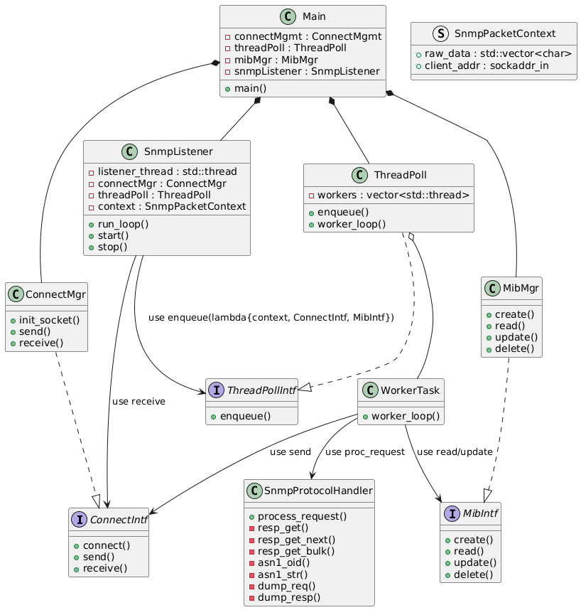

# az_lib_snmp
Header‑only SNMP library built with modern C++20. Provides lightweight, efficient tools for implementing SNMP agents and managers.

---

### Features

* **C++20 Standard:** Developed for modern C++ environments.
* **Header-Only:** Simple integration—just include the necessary headers.
* **Asynchronous I/O:** Built on MultiThreading architecture for non-blocking network operations.
* **Client & Server Roles:** Supports creating SNMP Servers for now.

---

### Architecture



---

### Getting Started (Prerequisites)

This project is header-only but depends on one external libraries. You **must** clone it into a top-level directory named `external/`.

1.  **Clone the Repository:**
    ```bash
    git clone [YOUR-REPO-URL] az_lib_snmp
    cd az_lib_snmp
    ```
2.  **Install Dependencies:**
    The following commands will set up the required **doctest** libraries in the `external/` folder:
    ```bash
    # Access the external directory
    cd external

    # Clone doctest (required for testing)
    git clone [https://github.com/onqtam/doctest.git](https://github.com/onqtam/doctest.git) external/doctest
    ```

---

### Usage and Integration

Since `az_lib_snmp` is **header-only**, you integrate it by including the necessary C++ header files in your project.

---

### Contributing

Contributions are welcome! Please feel free to open issues or submit pull requests.